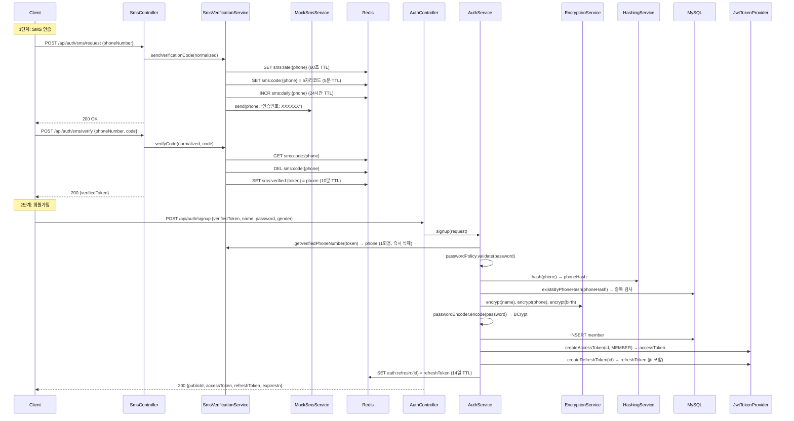
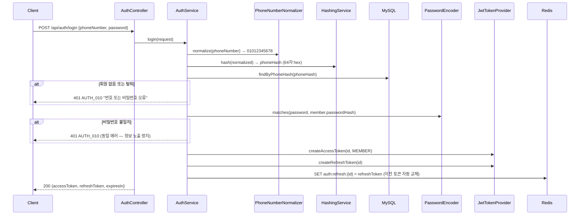
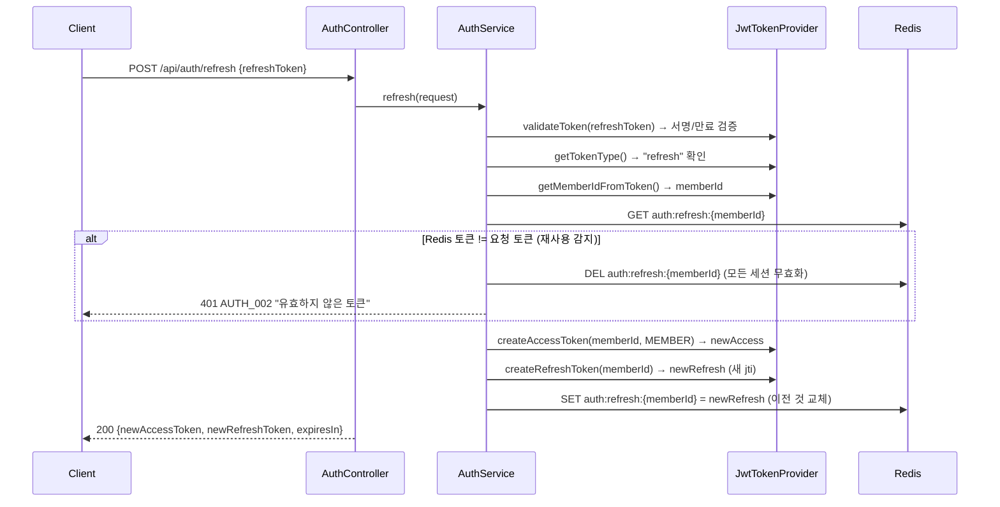
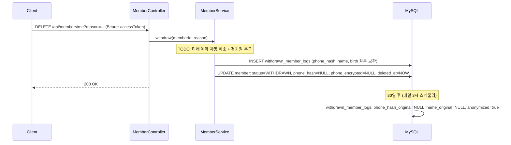

# 회원 도메인 아키텍처

## 1. 패키지 구조

```
com.pilates/
├── common/
│   ├── controller/     — 공통 컨트롤러 (Health, Test)
│   ├── entity/         — BaseEntity (audit + soft delete)
│   ├── error/          — ErrorCode, BusinessException, GlobalExceptionHandler
│   ├── logging/        — LoggingFilter (요청/응답 로깅, PII 마스킹)
│   ├── response/       — ApiResponse, PageResponse 래퍼
│   ├── security/
│   │   ├── auth/       — LoginMember, @LoginMemberAnnotation, ArgumentResolver
│   │   ├── encryption/ — AES-256/GCM 암호화 (EncryptionService)
│   │   ├── hash/       — SHA-256 해시, 전화번호 정규화
│   │   ├── jwt/        — JWT 발급/검증 (JwtTokenProvider)
│   │   └── password/   — 비밀번호 정책 (PasswordPolicy)
│   ├── sms/            — SmsService 인터페이스, MockSmsService
│   └── util/           — MaskingUtil
├── config/
│   ├── security/       — JwtFilter, EntryPoint, AccessDeniedHandler
│   ├── SecurityConfig  — Spring Security 설정
│   ├── WebConfig       — CORS, ArgumentResolver 등록
│   └── ...             — JPA, Redis, QueryDSL, Swagger 설정
└── domain/
    ├── auth/
    │   ├── controller/  — SmsController, AuthController
    │   ├── dto/         — 요청/응답 DTO (record)
    │   └── service/     — SmsVerificationService, AuthService
    ├── member/
    │   ├── controller/  — MemberController
    │   ├── dto/         — MemberResponse, MemberUpdateRequest 등
    │   ├── entity/      — Member, Gender, MemberStatus, WithdrawnMemberLog, MemberMemo
    │   ├── repository/  — MemberRepository, WithdrawnMemberLogRepository
    │   └── service/     — MemberService, ProfileImageService, AnonymizationScheduler
    └── (instructor, classroom, membership, reservation, payment, notification, admin)
```

## 2. 회원 도메인 흐름

### 2.1 회원가입 시퀀스



### 2.2 로그인 시퀀스



### 2.3 토큰 갱신 시퀀스 (Refresh Rotation)



### 2.4 탈퇴 시퀀스



## 3. 보안 정책

| 항목 | 방식 | 상세 |
|------|------|------|
| 이름·생년월일 | AES-256/GCM | 랜덤 IV, 키 버전 prefix `v1::` |
| 휴대폰 (검색) | SHA-256 | 64자 hex, 정규화 후 해시 |
| 휴대폰 (표시) | AES-256/GCM | 복호화하여 표시, 탈퇴 시 NULL |
| 비밀번호 | BCrypt | strength 12, 평문 로그 노출 방지 |
| JWT Access | HS256 | 30분, subject=memberId, role claim |
| JWT Refresh | HS256 + jti | 14일, Redis whitelist, Rotation |
| SMS Rate Limit | Redis TTL | 1분 1회, 일 5회 (고정 TTL) |
| 이미지 검증 | 매직 넘버 | JPEG(FF D8), PNG(89 50 4E 47), WebP(RIFF+WEBP) |
| 로그 PII | 마스킹 | password, code, verifiedToken 항상 `***` 처리 |

## 4. 데이터 정책

| 정책 | 대상 | 상세 |
|------|------|------|
| Soft Delete | members, instructors, memberships, reservations, admins | `deleted_at` TIMESTAMP NULL |
| 탈퇴 시 phone_hash NULL | members | 같은 번호 재가입 허용 (UNIQUE 우회) |
| 30일 익명화 | withdrawn_member_logs | 스케줄러가 매일 3시 실행 |
| 동시성 (정기권) | memberships.remaining_count | 비관적 락 `FOR UPDATE` |
| 동시성 (수업 정원) | class_schedules.current_count | 낙관적 락 `@Version` |
| 동시성 (회원 정보) | members | last-write-wins (v1) |
