# 회원 도메인 아키텍처

## 1. 패키지 구조

```
com.pilates/
├── common/
│   ├── controller/     — 공통 컨트롤러 (Health, Test)
│   ├── entity/         — BaseEntity (audit + soft delete)
│   ├── error/          — ErrorCode, BusinessException, GlobalExceptionHandler
│   ├── logging/        — LoggingFilter (요청/응답 로깅, PII 마스킹)
│   ├── response/       — ApiResponse, PageResponse 래퍼
│   ├── security/
│   │   ├── auth/       — LoginMember, @LoginMemberAnnotation, ArgumentResolver
│   │   ├── encryption/ — AES-256/GCM 암호화 (EncryptionService)
│   │   ├── hash/       — SHA-256 해시, 전화번호 정규화
│   │   ├── jwt/        — JWT 발급/검증 (JwtTokenProvider)
│   │   └── password/   — 비밀번호 정책 (PasswordPolicy)
│   ├── sms/            — SmsService 인터페이스, MockSmsService
│   └── util/           — MaskingUtil
├── config/
│   ├── security/       — JwtFilter, EntryPoint, AccessDeniedHandler
│   ├── SecurityConfig  — Spring Security 설정
│   ├── WebConfig       — CORS, ArgumentResolver 등록
│   └── ...             — JPA, Redis, QueryDSL, Swagger 설정
└── domain/
    ├── auth/
    │   ├── controller/  — SmsController, AuthController
    │   ├── dto/         — 요청/응답 DTO (record)
    │   └── service/     — SmsVerificationService, AuthService
    ├── member/
    │   ├── controller/  — MemberController
    │   ├── dto/         — MemberResponse, MemberUpdateRequest 등
    │   ├── entity/      — Member, Gender, MemberStatus, WithdrawnMemberLog, MemberMemo
    │   ├── repository/  — MemberRepository, WithdrawnMemberLogRepository
    │   └── service/     — MemberService, ProfileImageService, AnonymizationScheduler
    └── (instructor, classroom, membership, reservation, payment, notification, admin)
```

## 2. 회원 도메인 흐름

### 2.1 회원가입 시퀀스

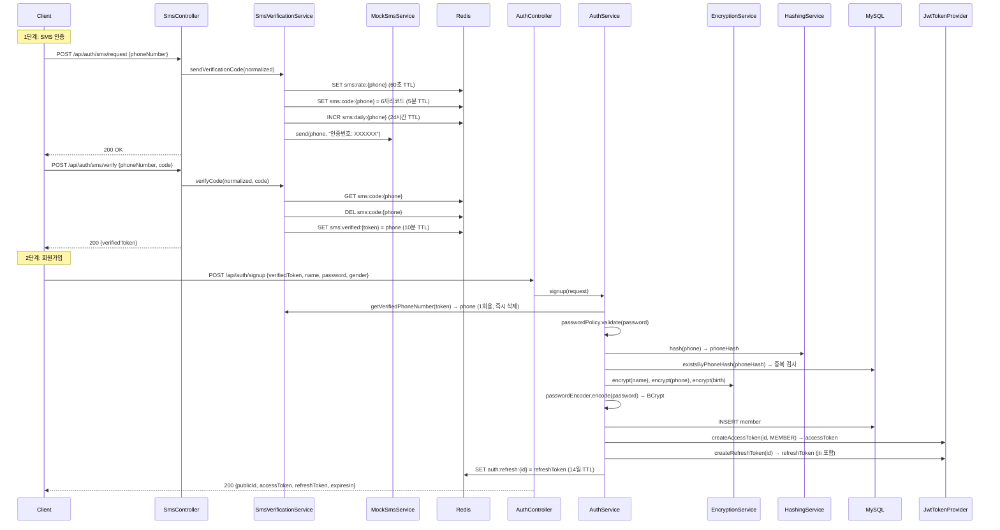

### 2.2 로그인 시퀀스

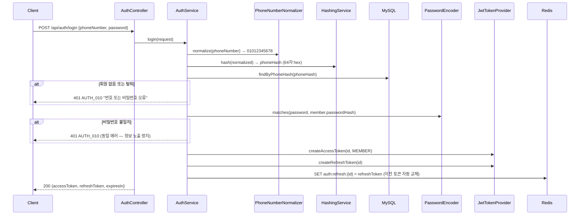

### 2.3 토큰 갱신 시퀀스 (Refresh Rotation)

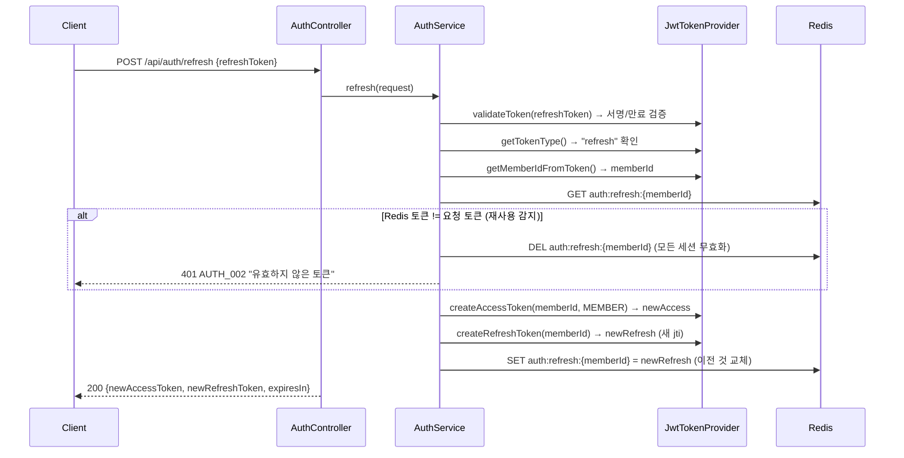

### 2.4 탈퇴 시퀀스

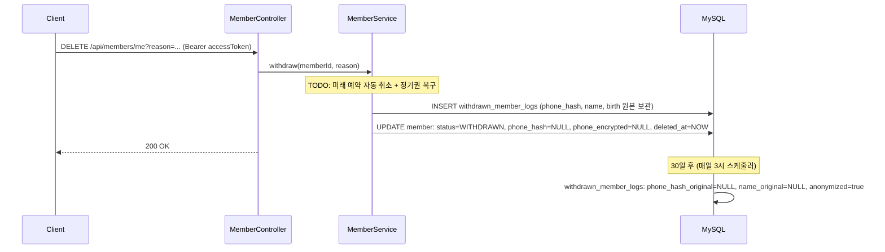

## 3. 보안 정책

| 항목 | 방식 | 상세 |
|------|------|------|
| 이름·생년월일 | AES-256/GCM | 랜덤 IV, 키 버전 prefix `v1::` |
| 휴대폰 (검색) | SHA-256 | 64자 hex, 정규화 후 해시 |
| 휴대폰 (표시) | AES-256/GCM | 복호화하여 표시, 탈퇴 시 NULL |
| 비밀번호 | BCrypt | strength 12, 평문 로그 노출 방지 |
| JWT Access | HS256 | 30분, subject=memberId, role claim |
| JWT Refresh | HS256 + jti | 14일, Redis whitelist, Rotation |
| SMS Rate Limit | Redis TTL | 1분 1회, 일 5회 (고정 TTL) |
| 이미지 검증 | 매직 넘버 | JPEG(FF D8), PNG(89 50 4E 47), WebP(RIFF+WEBP) |
| 로그 PII | 마스킹 | password, code, verifiedToken 항상 `***` 처리 |

## 4. 데이터 정책

| 정책 | 대상 | 상세 |
|------|------|------|
| Soft Delete | members, instructors, memberships, reservations, admins | `deleted_at` TIMESTAMP NULL |
| 탈퇴 시 phone_hash NULL | members | 같은 번호 재가입 허용 (UNIQUE 우회) |
| 30일 익명화 | withdrawn_member_logs | 스케줄러가 매일 3시 실행 |
| 동시성 (정기권) | memberships.remaining_count | 비관적 락 `FOR UPDATE` |
| 동시성 (수업 정원) | class_schedules.current_count | 낙관적 락 `@Version` |
| 동시성 (회원 정보) | members | last-write-wins (v1) |

## 5. 강사 + 수업 도메인

### 5.1 패키지 구조
```
domain/instructor/
├── controller/  AdminInstructorController, PublicInstructorController
├── dto/         InstructorRegisterRequest, InstructorResponse, AvailableTimeRequest 등
├── repository/  InstructorRepository, InstructorAvailableTimeRepository
└── service/     InstructorService

domain/classroom/
├── controller/  AdminLessonTypeController, AdminFixedScheduleController,
│                AdminClassScheduleController, MemberClassScheduleController,
│                PublicLessonTypeController
├── dto/         LessonTypeRequest, FixedScheduleRequest, ClassScheduleResponse 등
├── repository/  LessonTypeRepository, FixedScheduleRepository, ClassScheduleRepository
├── scheduler/   ClassScheduleGenerator (매주 일요일 자정)
└── service/     LessonTypeService, FixedScheduleService, ClassScheduleService
```

### 5.2 시간표 구조 (2단계)

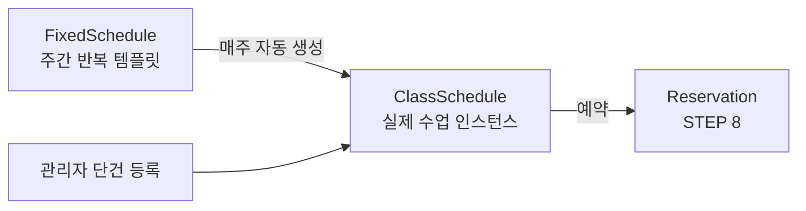

- **FixedSchedule**: "매주 월요일 10:00 박지영 그룹" (템플릿)
- **ClassSchedule**: "2026-05-12 월 10:00 박지영 그룹" (실제 수업)
- 자동 생성: 매주 일요일 자정, 다음 4주치
- 수동 생성: 관리자 API로 즉시 (멱등)

### 5.3 자동 생성 시퀀스

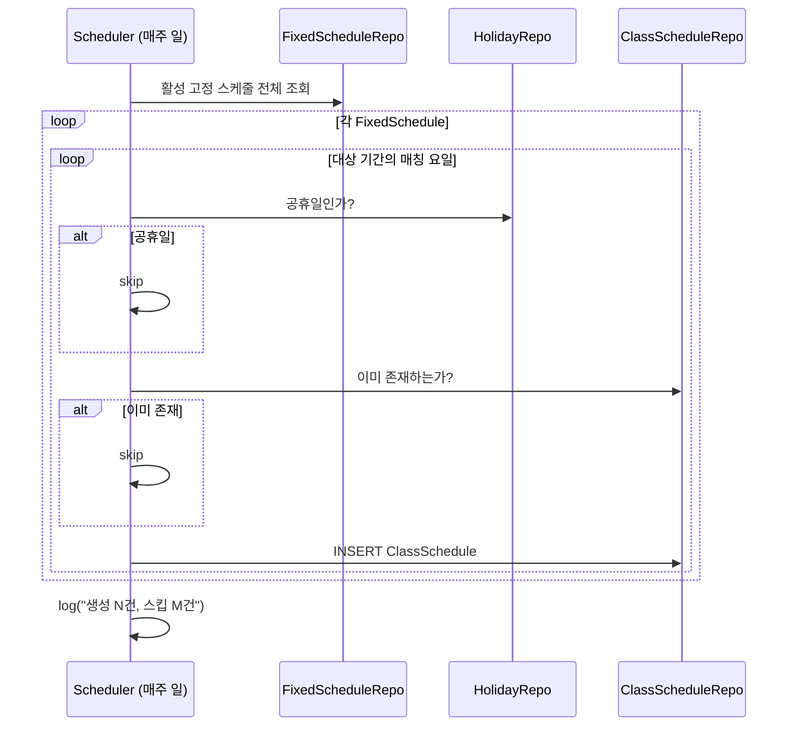

### 5.4 권한별 API 매트릭스

| API 경로 | ADMIN | INSTRUCTOR | MEMBER | 비인증 |
|----------|-------|------------|--------|--------|
| /api/admin/instructors/** | O | X | X | X |
| /api/admin/lesson-types/** | O | X | X | X |
| /api/admin/fixed-schedules/** | O | X | X | X |
| /api/admin/class-schedules/** | O | X | X | X |
| /api/instructors/** | O | O | O | O* |
| /api/lesson-types/** | O | O | O | O* |
| /api/class-schedules/** | O | O | O | O* |

\* v1에서는 공개 조회 API는 permitAll (인증 불필요)

## 6. 정기권(Membership) 도메인

### 6.1 상태 머신

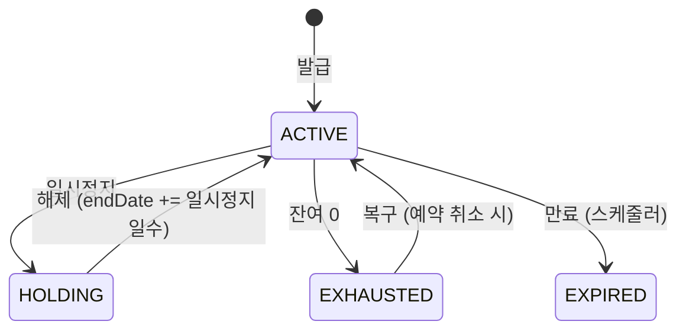

### 6.2 발급 시퀀스

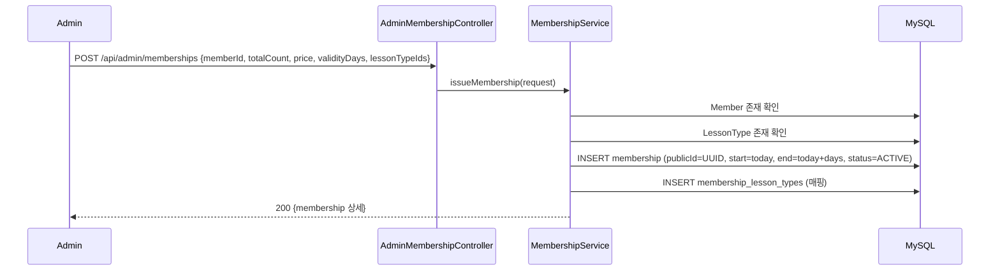

### 6.3 차감/복구 정책
- **차감**: `Membership.deduct(count)` — 비관적 락 하에서 호출 (STEP 8 reservation)
- **무제한권**: 차감 없음, 월 한도는 Service 레벨 카운팅
- **복구**: `Membership.restore(count)` — 예약 취소 시 (STEP 8)
- **소진**: 잔여 0이면 자동 EXHAUSTED, 복구 시 ACTIVE 복귀

### 6.4 만료 스케줄러
- 매일 새벽 4시 실행
- end_date < today AND status NOT IN (EXPIRED, EXHAUSTED, HOLDING)
- HOLDING 중 만료: HOLDING 우선 유지 (TODO: 의뢰인 정책 확인)

\* v1에서는 공개 조회 API는 permitAll (인증 불필요)

## 7. 인증·권한 시스템

### 7.1 역할 (Role)

| 역할 | JWT subject | JWT claim | 설명 |
|------|------------|-----------|------|
| MEMBER | members.id | role=MEMBER | 회원 (SMS 가입) |
| INSTRUCTOR | admins.id | role=INSTRUCTOR, instructorId | 강사 (admin 로그인) |
| ADMIN | admins.id | role=ADMIN | 관리자 |
| SUPER_ADMIN | admins.id | role=SUPER_ADMIN | 슈퍼 관리자 |

### 7.2 권한 매트릭스

| 경로 | MEMBER | INSTRUCTOR | ADMIN | SUPER_ADMIN |
|------|--------|------------|-------|-------------|
| /api/auth/** | permitAll | | | |
| /api/admin/auth/** | permitAll | | | |
| /api/health, /api/test/** | permitAll | | | |
| /api/instructors/** (공개) | permitAll | | | |
| /api/class-schedules/** (공개) | permitAll | | | |
| /api/admin/** | X | O | O | O |
| /api/instructor/** | X | O | O | O |
| /api/members/me/** | O | O | O | O |
| 기타 (인증 필요) | O | O | O | O |

### 7.3 인증 시퀀스

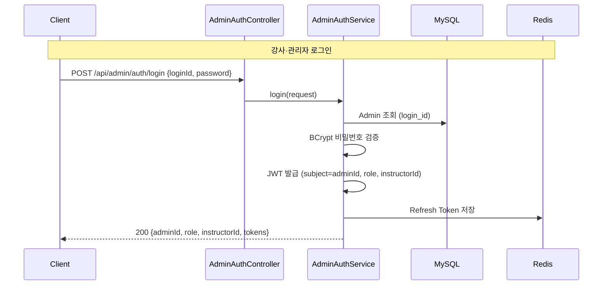

### 7.4 JWT 토큰 구조
- **subject**: userId (members.id 또는 admins.id)
- **claim "role"**: MEMBER / INSTRUCTOR / ADMIN / SUPER_ADMIN
- **claim "instructorId"**: 강사인 경우만 (instructors.id)
- **claim "type"**: access / refresh

## 9. attendance 도메인

### 9.1 패키지 구조

```
domain/attendance/
├── controller/
│   ├── InstructorAttendanceController  — 강사 출석 체크 API
│   ├── MemberAttendanceController      — 회원 본인 이력 API
│   └── AdminAttendanceController       — 관리자 통계 API
├── dto/
│   ├── AttendanceMarkRequest           — 단건 출석 요청
│   ├── BatchAttendanceRequest          — 일괄 출석 요청
│   ├── AttendanceResponse              — 출석 응답
│   ├── AttendanceRateResponse          — 출석률 응답
│   └── NoShowCountResponse             — 노쇼 카운트 응답
├── entity/
│   ├── Attendance                      — 출석 엔티티 (reservation 1:1)
│   └── AttendanceStatus                — PENDING → ATTENDED/LATE/ABSENT/NO_SHOW
├── repository/
│   └── AttendanceRepository            — JPA 쿼리
└── service/
    ├── InstructorAttendanceService     — 강사 출석 체크 로직
    └── MemberAttendanceService         — 이력/출석률 조회
```

### 9.2 출석 상태 머신

```
                 ┌─── markAttended(instructorId) ──→ ATTENDED
                 │
PENDING ─────────┼─── markLate(instructorId) ──────→ LATE
  (예약 생성 시)  │
                 ├─── markAbsent(instructorId) ────→ ABSENT
                 │
                 └─── markNoShow() (스케줄러) ─────→ NO_SHOW

* 강사 마킹 간 재변경 허용 (ATTENDED ↔ LATE ↔ ABSENT)
* 강사가 마킹한 건(ATTENDED/LATE/ABSENT)은 노쇼 스케줄러가 덮어쓰지 않음
```

### 9.3 출석 체크 시퀀스

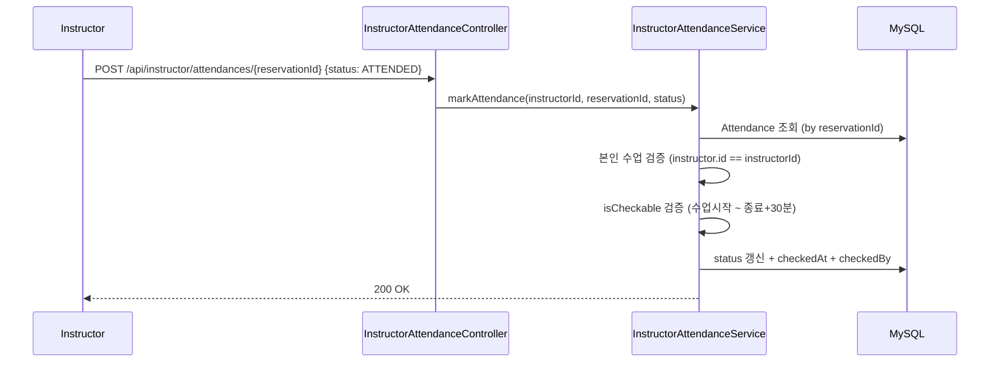

### 9.4 노쇼 자동 마킹 흐름

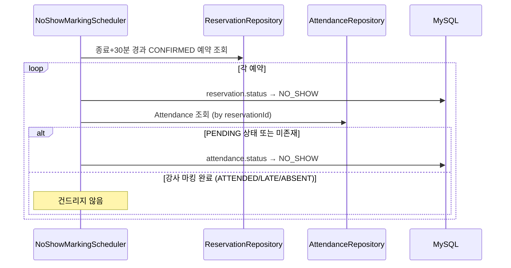

### 9.5 예약-출석 연동
- **예약 생성**: `Attendance.createPending(reservation)` 자동 INSERT
- **예약 취소**: `attendanceRepository.deleteByReservationId()` 삭제
- **휴강 취소**: 각 예약의 Attendance도 삭제

### 9.6 API 엔드포인트

| Method | Path | Role | 설명 |
|--------|------|------|------|
| POST | /api/instructor/attendances/{reservationId} | INSTRUCTOR | 단건 출석 체크 |
| POST | /api/instructor/class-schedules/{id}/attendances | INSTRUCTOR | 일괄 출석 체크 |
| GET | /api/instructor/class-schedules/{id}/attendances | INSTRUCTOR | 수업 출석 현황 |
| GET | /api/members/me/attendances | MEMBER | 내 출석 이력 (페이지네이션) |
| GET | /api/members/me/attendance-rate | MEMBER | 내 출석률 |
| GET | /api/admin/members/{id}/attendance-rate | ADMIN | 회원 출석률 |
| GET | /api/admin/attendances/no-show-counts | ADMIN | 회원별 노쇼 횟수 |
