# ERD (Entity-Relationship Diagram)

## 도메인 그룹 요약

| 그룹 | 테이블 | 설명 |
|------|--------|------|
| 회원 | `members` | 필라테스 수강 회원 |
| 회원 | `member_memos` | 강사가 작성하는 회원별 메모 (신체 특이사항 등) |
| 회원 | `withdrawn_member_logs` | 탈퇴 회원 개인정보 보관 (30일 후 익명화) |
| 강사 | `instructors` | 필라테스 강사 |
| 강사 | `instructor_available_times` | 강사 근무 가능 시간대 |
| 수업 | `lesson_types` | 수업 유형 마스터 (개인/듀엣/그룹/체험) |
| 수업 | `class_schedules` | 실제 수업 시간표 (단건 + 반복 생성분) |
| 수업 | `fixed_schedules` | 주간 고정 반복 스케줄 템플릿 |
| 정기권 | `memberships` | 회원이 구매한 수강권 |
| 정기권 | `membership_holdings` | 정기권 홀딩(일시정지) 이력 |
| 정기권 | `membership_lesson_types` | 정기권-수업 유형 매핑 (1:N) |
| 예약 | `reservations` | 회원의 수업 예약 |
| 결제 | `payments` | 정기권 결제 내역 |
| 출석 | `attendances` | 수업 출석 기록 |
| 알림 | `notifications` | 알림톡 발송 이력 |
| 관리자 | `admins` | 관리자/강사 로그인 계정 |
| 설정 | `studio_settings` | 스튜디오 전역 설정 (취소 규칙, 수업 시간 등) |
| 설정 | `holidays` | 휴무일/공휴일 |

## ERD (Mermaid)

```mermaid
erDiagram
    %% ── 회원 ──
    members {
        bigint id PK
        varchar public_id UK "외부 노출 ID"
        varchar name "암호화 이름"
        varchar phone_encrypted "AES 암호화 휴대폰"
        varchar phone_hash UK "SHA-256 해시 (검색용)"
        varchar birth_encrypted "AES 암호화 생년월일"
        enum gender "MALE, FEMALE"
        enum status "ACTIVE, DORMANT, WITHDRAWN"
        bigint instructor_id FK "담당 강사 (선택)"
        timestamp created_at
        timestamp updated_at
        timestamp deleted_at
    }

    member_memos {
        bigint id PK
        bigint member_id FK
        bigint instructor_id FK "작성 강사"
        text content "메모 내용"
        timestamp created_at
        timestamp updated_at
    }

    %% ── 강사 ──
    instructors {
        bigint id PK
        varchar public_id UK
        varchar name
        varchar phone
        enum status "ACTIVE, INACTIVE"
        varchar profile_image_url
        timestamp created_at
        timestamp updated_at
        timestamp deleted_at
    }

    instructor_available_times {
        bigint id PK
        bigint instructor_id FK
        enum day_of_week "MON~SUN"
        time start_time
        time end_time
        timestamp created_at
    }

    %% ── 수업 ──
    lesson_types {
        bigint id PK
        varchar name "개인, 듀엣, 그룹, 체험"
        int max_capacity "정원"
        int duration_minutes "수업 시간 (분)"
        int deduction_count "차감 횟수 (개인=2, 기본=1)"
        boolean is_active
        timestamp created_at
        timestamp updated_at
    }

    fixed_schedules {
        bigint id PK
        bigint instructor_id FK
        bigint lesson_type_id FK
        enum day_of_week "MON~SUN"
        time start_time
        time end_time
        boolean is_active
        timestamp created_at
        timestamp updated_at
    }

    class_schedules {
        bigint id PK
        bigint instructor_id FK
        bigint lesson_type_id FK
        bigint fixed_schedule_id FK "반복 생성이면 원본 참조, 단건이면 NULL"
        date class_date
        time start_time
        time end_time
        int max_capacity
        int current_count "현재 예약 인원"
        int version "낙관적 락"
        enum status "SCHEDULED, CANCELLED, COMPLETED"
        timestamp created_at
        timestamp updated_at
    }

    %% ── 탈퇴 회원 로그 ──
    withdrawn_member_logs {
        bigint id PK
        bigint member_id FK
        varchar phone_hash_original "30일 후 NULL"
        varchar name_original "30일 후 NULL"
        varchar birth_encrypted_original "30일 후 NULL"
        timestamp withdrawn_at
        varchar withdrawal_reason
        boolean anonymized
        timestamp anonymized_at
    }

    %% ── 정기권 ──
    memberships {
        bigint id PK
        varchar public_id UK
        bigint member_id FK
        int total_count "총 횟수"
        int remaining_count "잔여 횟수"
        boolean is_unlimited
        date start_date
        date end_date
        decimal price "금액"
        enum status "ACTIVE, EXPIRED, EXHAUSTED, HOLDING"
        timestamp created_at
        timestamp updated_at
        timestamp deleted_at
    }

    %% ── 정기권-수업 유형 매핑 ──
    membership_lesson_types {
        bigint id PK
        bigint membership_id FK
        bigint lesson_type_id FK
        timestamp created_at
    }

    membership_holdings {
        bigint id PK
        bigint membership_id FK
        date hold_start_date
        date hold_end_date
        varchar reason
        int extended_days "연장된 일수"
        timestamp created_at
    }

    %% ── 예약 ──
    reservations {
        bigint id PK
        bigint member_id FK
        bigint class_schedule_id FK
        bigint membership_id FK "사용된 정기권"
        enum status "CONFIRMED, WAITING, CANCELLED, NO_SHOW"
        int wait_order "대기 순번 (NULL이면 확정)"
        varchar cancel_reason
        timestamp cancelled_at
        timestamp created_at
        timestamp updated_at
        timestamp deleted_at
    }

    %% ── 출석 ──
    attendances {
        bigint id PK
        bigint reservation_id UK "예약 1:1 (FK)"
        bigint member_id FK
        bigint class_schedule_id "FK"
        enum status "ATTENDED, ABSENT, LATE"
        timestamp checked_at "출석 체크 시각"
        bigint checked_by "체크한 관리자/강사 ID"
        timestamp created_at
    }

    %% ── 결제 ──
    payments {
        bigint id PK
        varchar order_id UK "결제 고유 번호"
        bigint member_id FK
        bigint membership_id FK
        decimal amount
        enum method "CARD, CASH, TRANSFER"
        enum status "COMPLETED, REFUNDED, PARTIAL_REFUND"
        decimal refund_amount
        varchar refund_reason
        timestamp paid_at
        timestamp refunded_at
        timestamp created_at
        timestamp updated_at
    }

    %% ── 알림 ──
    notifications {
        bigint id PK
        bigint member_id FK
        enum type "RESERVATION_CONFIRM, REMINDER_1DAY, REMINDER_2HOUR, CANCELLATION, MEMBERSHIP_EXPIRING, MEMBERSHIP_LOW"
        varchar template_code "알림톡 템플릿 코드"
        text content
        enum status "PENDING, SENT, FAILED"
        varchar failure_reason
        timestamp scheduled_at
        timestamp sent_at
        timestamp created_at
    }

    %% ── 관리자 ──
    admins {
        bigint id PK
        varchar login_id UK
        varchar password_hash
        varchar name
        enum role "SUPER_ADMIN, ADMIN, INSTRUCTOR"
        bigint instructor_id FK "강사 연결 (강사 역할인 경우)"
        boolean is_active
        timestamp last_login_at
        timestamp created_at
        timestamp updated_at
        timestamp deleted_at
    }

    %% ── 설정 ──
    studio_settings {
        bigint id PK
        varchar setting_key UK
        varchar setting_value
        varchar description
        timestamp updated_at
    }

    holidays {
        bigint id PK
        date holiday_date UK
        varchar name
        timestamp created_at
    }

    %% ── 관계 ──
    members ||--o{ withdrawn_member_logs : "logs withdrawal"
    members ||--o{ member_memos : "has"
    members ||--o{ memberships : "purchases"
    members ||--o{ reservations : "makes"
    members ||--o{ attendances : "records"
    members ||--o{ payments : "pays"
    members ||--o{ notifications : "receives"
    members }o--o| instructors : "assigned to"

    instructors ||--o{ instructor_available_times : "has"
    instructors ||--o{ class_schedules : "teaches"
    instructors ||--o{ fixed_schedules : "has"
    instructors ||--o{ member_memos : "writes"

    lesson_types ||--o{ class_schedules : "defines"
    lesson_types ||--o{ fixed_schedules : "defines"
    lesson_types ||--o{ membership_lesson_types : "mapped"

    membership_lesson_types }o--|| memberships : "belongs to"

    fixed_schedules ||--o{ class_schedules : "generates"

    class_schedules ||--o{ reservations : "has"
    class_schedules ||--o{ attendances : "has"

    memberships ||--o{ membership_holdings : "has"
    memberships ||--o{ reservations : "used by"
    memberships ||--o{ payments : "paid by"

    reservations ||--o| attendances : "checked"

    admins }o--o| instructors : "linked"
```

## 주요 관계 정리

| 관계 | 설명 |
|------|------|
| 회원 1:N 탈퇴로그 | 탈퇴 시 개인정보 원본 보관 (30일 후 익명화) |
| 회원 1:N 정기권 | 한 회원이 여러 정기권 구매 가능 |
| 회원 1:N 예약 | 한 회원이 여러 수업 예약 |
| 정기권 1:N 예약 | 예약 시 어떤 정기권에서 차감되는지 추적 |
| 정기권 1:N 홀딩 | 한 정기권에 여러 번 홀딩 가능 |
| 정기권 N:M 수업유형 | 중간 테이블(membership_lesson_types)로 매핑 |
| 정기권 1:1 결제 | 정기권 구매 시 결제 1건 |
| 수업 시간표 1:N 예약 | 한 수업에 여러 회원 예약 |
| 예약 1:1 출석 | 예약 건당 출석 기록 1건 |
| 고정 스케줄 1:N 수업 시간표 | 고정 스케줄에서 주별 수업 자동 생성 |
| 강사 1:N 수업 시간표 | 강사가 여러 수업 담당 |
| 관리자 0..1:1 강사 | 강사 역할의 관리자는 강사 테이블과 연결 |
