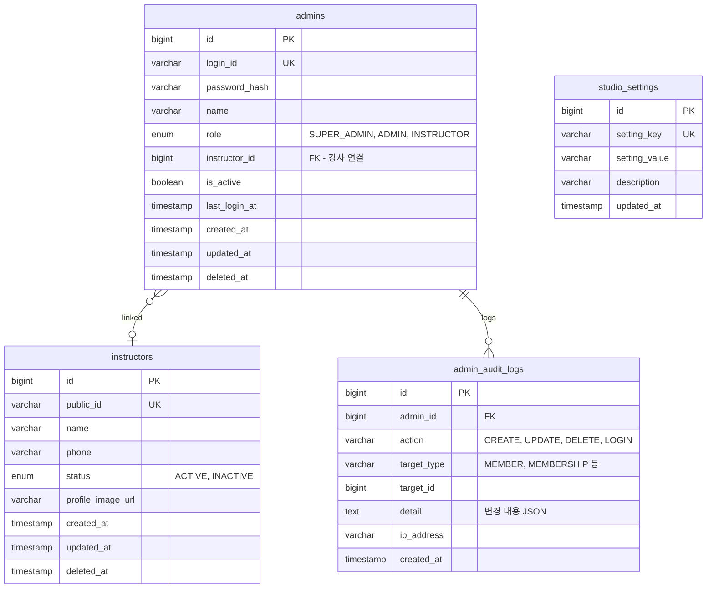

# ERD: 관리자 도메인 (admins, instructors, studio_settings, admin_audit_logs)

```mermaid
erDiagram
    admins {
        bigint id PK
        varchar login_id UK
        varchar password_hash
        varchar name
        enum role "SUPER_ADMIN, ADMIN, INSTRUCTOR"
        bigint instructor_id "FK - 강사 연결"
        boolean is_active
        timestamp last_login_at
        timestamp created_at
        timestamp updated_at
        timestamp deleted_at
    }

    instructors {
        bigint id PK
        varchar public_id UK
        varchar name
        varchar phone
        enum status "ACTIVE, INACTIVE"
        varchar profile_image_url
        timestamp created_at
        timestamp updated_at
        timestamp deleted_at
    }

    admin_audit_logs {
        bigint id PK
        bigint admin_id "FK"
        varchar action "CREATE, UPDATE, DELETE, LOGIN"
        varchar target_type "MEMBER, MEMBERSHIP 등"
        bigint target_id
        text detail "변경 내용 JSON"
        varchar ip_address
        timestamp created_at
    }

    studio_settings {
        bigint id PK
        varchar setting_key UK
        varchar setting_value
        varchar description
        timestamp updated_at
    }

    admins }o--o| instructors : "linked"
    admins ||--o{ admin_audit_logs : "logs"
```
