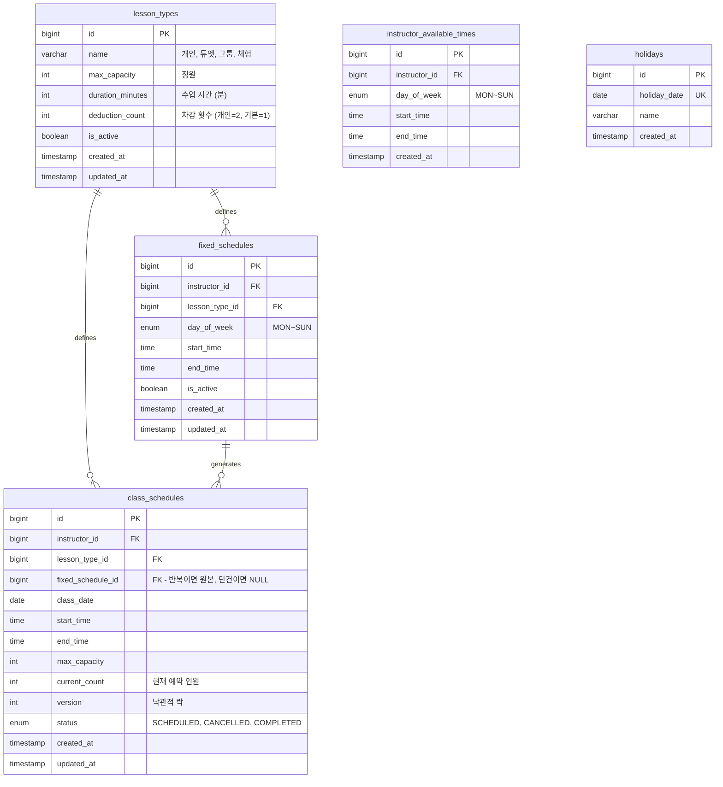

# ERD: 수업/스케줄 도메인 (lesson_types, fixed_schedules, class_schedules, instructor_available_times, holidays)

```mermaid
erDiagram
    lesson_types {
        bigint id PK
        varchar name "개인, 듀엣, 그룹, 체험"
        int max_capacity "정원"
        int duration_minutes "수업 시간 (분)"
        int deduction_count "차감 횟수 (개인=2, 기본=1)"
        boolean is_active
        timestamp created_at
        timestamp updated_at
    }

    fixed_schedules {
        bigint id PK
        bigint instructor_id FK
        bigint lesson_type_id "FK"
        enum day_of_week "MON~SUN"
        time start_time
        time end_time
        boolean is_active
        timestamp created_at
        timestamp updated_at
    }

    class_schedules {
        bigint id PK
        bigint instructor_id FK
        bigint lesson_type_id "FK"
        bigint fixed_schedule_id "FK - 반복이면 원본, 단건이면 NULL"
        date class_date
        time start_time
        time end_time
        int max_capacity
        int current_count "현재 예약 인원"
        int version "낙관적 락"
        enum status "SCHEDULED, CANCELLED, COMPLETED"
        timestamp created_at
        timestamp updated_at
    }

    instructor_available_times {
        bigint id PK
        bigint instructor_id FK
        enum day_of_week "MON~SUN"
        time start_time
        time end_time
        timestamp created_at
    }

    holidays {
        bigint id PK
        date holiday_date UK
        varchar name
        timestamp created_at
    }

    lesson_types ||--o{ fixed_schedules : "defines"
    lesson_types ||--o{ class_schedules : "defines"
    fixed_schedules ||--o{ class_schedules : "generates"
```
