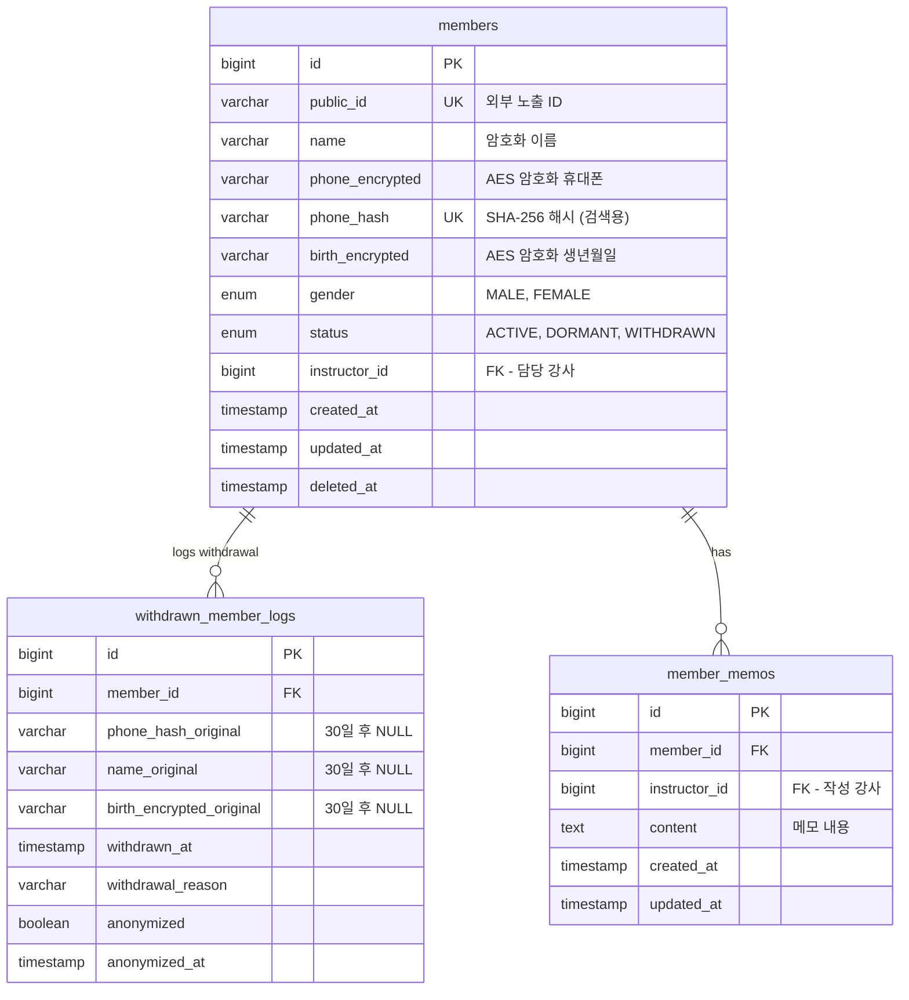

# ERD: 회원 도메인 (members, withdrawn_member_logs, member_memos)

```mermaid
erDiagram
    members {
        bigint id PK
        varchar public_id UK "외부 노출 ID"
        varchar name "암호화 이름"
        varchar phone_encrypted "AES 암호화 휴대폰"
        varchar phone_hash UK "SHA-256 해시 (검색용)"
        varchar birth_encrypted "AES 암호화 생년월일"
        enum gender "MALE, FEMALE"
        enum status "ACTIVE, DORMANT, WITHDRAWN"
        bigint instructor_id "FK - 담당 강사"
        timestamp created_at
        timestamp updated_at
        timestamp deleted_at
    }

    withdrawn_member_logs {
        bigint id PK
        bigint member_id FK
        varchar phone_hash_original "30일 후 NULL"
        varchar name_original "30일 후 NULL"
        varchar birth_encrypted_original "30일 후 NULL"
        timestamp withdrawn_at
        varchar withdrawal_reason
        boolean anonymized
        timestamp anonymized_at
    }

    member_memos {
        bigint id PK
        bigint member_id FK
        bigint instructor_id "FK - 작성 강사"
        text content "메모 내용"
        timestamp created_at
        timestamp updated_at
    }

    members ||--o{ withdrawn_member_logs : "logs withdrawal"
    members ||--o{ member_memos : "has"
```
