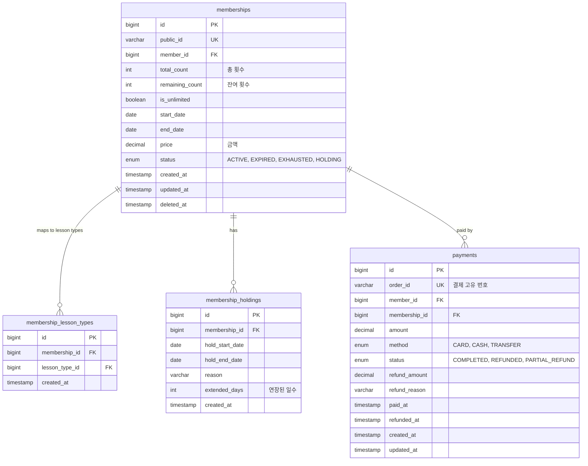

# ERD: 정기권/결제 도메인 (memberships, membership_lesson_types, membership_holdings, payments)

```mermaid
erDiagram
    memberships {
        bigint id PK
        varchar public_id UK
        bigint member_id FK
        int total_count "총 횟수"
        int remaining_count "잔여 횟수"
        boolean is_unlimited
        date start_date
        date end_date
        decimal price "금액"
        enum status "ACTIVE, EXPIRED, EXHAUSTED, HOLDING"
        timestamp created_at
        timestamp updated_at
        timestamp deleted_at
    }

    membership_lesson_types {
        bigint id PK
        bigint membership_id FK
        bigint lesson_type_id "FK"
        timestamp created_at
    }

    membership_holdings {
        bigint id PK
        bigint membership_id FK
        date hold_start_date
        date hold_end_date
        varchar reason
        int extended_days "연장된 일수"
        timestamp created_at
    }

    payments {
        bigint id PK
        varchar order_id UK "결제 고유 번호"
        bigint member_id FK
        bigint membership_id "FK"
        decimal amount
        enum method "CARD, CASH, TRANSFER"
        enum status "COMPLETED, REFUNDED, PARTIAL_REFUND"
        decimal refund_amount
        varchar refund_reason
        timestamp paid_at
        timestamp refunded_at
        timestamp created_at
        timestamp updated_at
    }

    memberships ||--o{ membership_lesson_types : "maps to lesson types"
    memberships ||--o{ membership_holdings : "has"
    memberships ||--o{ payments : "paid by"
```
