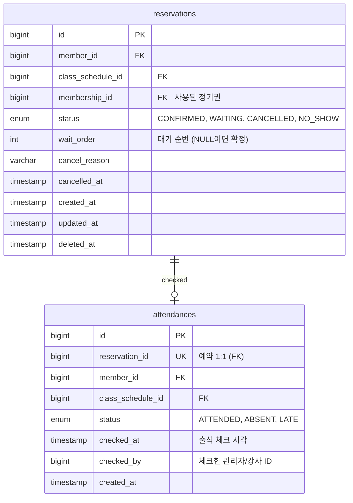

# ERD: 예약/출석 도메인 (reservations, attendances)

```mermaid
erDiagram
    reservations {
        bigint id PK
        bigint member_id FK
        bigint class_schedule_id "FK"
        bigint membership_id "FK - 사용된 정기권"
        enum status "CONFIRMED, WAITING, CANCELLED, NO_SHOW"
        int wait_order "대기 순번 (NULL이면 확정)"
        varchar cancel_reason
        timestamp cancelled_at
        timestamp created_at
        timestamp updated_at
        timestamp deleted_at
    }

    attendances {
        bigint id PK
        bigint reservation_id UK "예약 1:1 (FK)"
        bigint member_id FK
        bigint class_schedule_id "FK"
        enum status "ATTENDED, ABSENT, LATE"
        timestamp checked_at "출석 체크 시각"
        bigint checked_by "체크한 관리자/강사 ID"
        timestamp created_at
    }

    reservations ||--o| attendances : "checked"
```
